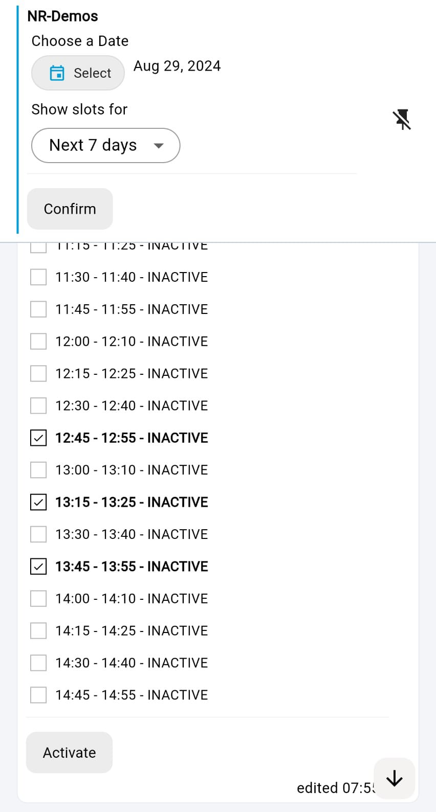

# Booking Service

## ✨ What's this about

Discover how quick and easy is to book visits, meeting rooms, sell event seats, rent cars, and so on... with no need for dedicated frameworks or custom development. Install, configure your environment, get paid for your services.

The **Booking Service** semilimes recipe takes advantage of the [semilimes](https://www.semilimes.com) platform services to setup any kind of bookable items over time, integrate your preferred payment service and book/sell your items. All on your mobile phones.

Get your free [semilimes app](https://www.semilimes.com) and start exploring this and other extension recipes!

## 🔎 What do you get

In this recipe, we offer an implementation of a medical visit booking, where the doctor sets up his available slots during each day, and patients can find and pay for any upcoming available appointments.

Main features:

- Fully hosted or self-hosted configuration environment. You choose the option that fits for you.

- Centralized and configurable functions to generate the bookable items

- Search and input forms for the administrator (doctor) to activate the available time slots during each day.

- Fully automated payment service (Stripe) integration to generate payment links for the users (patients)

- Search and input forms for the users (patients) to look for the upcoming available slots and book/pay for them.

- Automated appointment reminders for both the admin and the users, which can be directly imported to the phones' calendar.

- Fully open-sourced solution. You can use it as it is, tweak or extend it as much as you like. Everything under your control!

## 📽️ How does it work

...

## ⚙️ Configuration instructions

...

## 💡Extension ideas 

...

## 🛠️ Troubleshooting 

...
