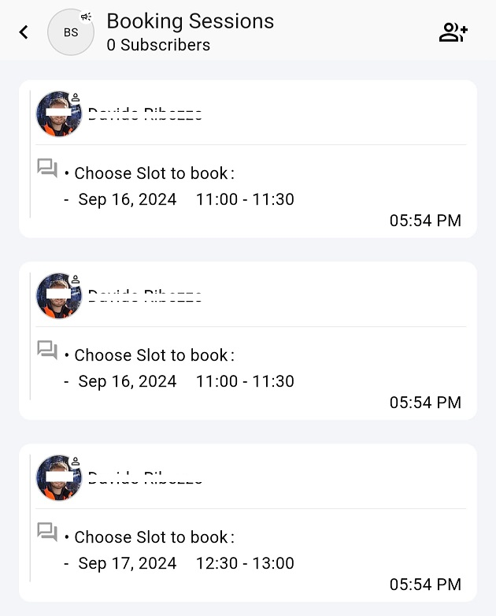
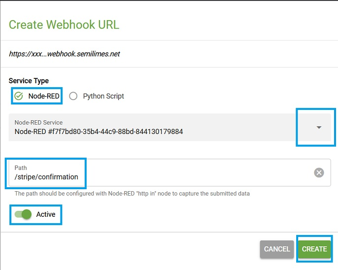

# Booking Service

## ✨ What's this about

Discover how quick and easy is to book visits, meeting rooms, sell event seats, rent cars, and so on... with no need for dedicated frameworks or custom development. Install, configure your environment, get paid for your services.

The **Booking Service** semilimes recipe takes advantage of the [semilimes](https://www.semilimes.com) platform services to setup any kind of bookable items over time, integrate your preferred payment service and book/sell your items. All on your mobile phones.

Get your free [semilimes app](https://www.semilimes.com) and start exploring this and other extension recipes!

## 🔎 What do you get

In this recipe, we offer an implementation of a medical visit booking, where the doctor sets up his available slots during each day, and patients can find and pay for any upcoming available appointments.

### Hosting options

You can choose to download this recipe and self-host it in any node-red environment. For a hassle-free approach, you can use the [semilimes Services](https://my.semilimes.net) to fully manage your recipe directly in a cloud-based environment. Choose the option that best fits for you.

### Centralized data

This recipe uses file-based databases hosted in the NodeRED environment, and you get configurable functions to setup the generation rules of the bookable items you need in your business. In this implementation rule, each selected day, from 9am to 3pm, is populated with slots of 10 minutes, with a pause of 5 minutes between each. 

### Administration forms

The administrator (doctor) is provided with an `slot activation` form to look for the slots to activate in each day.

### Stripe account integration

You don't need to operate on your payment service. Just connect your Stripe payment account and the automatic integration will create payment objects for each bookable slot that has been activated by the administrator.

### User forms

The users who access this system are provided with a `slot booking` form where only activated slots are proposed. The users can then directly reach the Stripe payment service to complete payment.

### Booked appointment reminders

Upon payment, automatic reminders are sent to both the administrator and the user, which can be imported to the phones' calendar.

### Free solution

You can use it as it is, tweak or extend it as much as you like. Everything is under your control!

## 📽️ How does it work

After this recipe is activated, the following will happen under the used subaccount...

### Internal Calendar creation

A new empty file-based calendar will be created under your NodeRED instance, ready to be populated with events

### Bookings Admin channel creation

The `Bookings Admin` channel is created and populated with a date/slot selection form, meant to be used by the admin to find and activate bookable slots, and to check if slots have been already booked.

### Booking session private chat

In semilimes app, each user accessing this system will be placed in a private chat with this subaccount to privately process the date/slot selection and booking.

### Booking Sessions internal channel creation

The `Booking Sessions` channel is an internal channel meant to receive each user selection during his booking session. This channel should not be shared with anyone since it may contain personal information.

### Stripe integration

Upon (multi)selection and confirmation of `INACTIVE` slots in the `Bookings Admin` channel, the system will activate these slots and automatically create Stripe payment links for each of them, binding the relevant information in both directions:

- The booked slot will contain the link to the Stripe payment link
- Each Stripe payment link will contain metadata about the booked slot it is bound to, for data reconciliation.

Upon slot selection of a user, the Stripe payment link URL will be dynamically configured with a `client_reference_id` parameter holding the semilimes user account, so that Stripe knows who is actually going to pay for it.

Upon payment completion of a slot by a user on Stripe, the latter will send a webhook request to the booking system to make sure the slot is booked on behalf of the user that actually paid for it.

### Auto-reminders

Upon payment completion of a slot by a user, the booking system will send customized appointment messages to both the admin and the paying user. These appointment messages can be opened in the semilimes app and saved on the personal phone's agenda.

## ⚙️ Configuration instructions

### Cloud-based solution

**Step 1: Create a NodeRED Instance**

- Access the [semilimes Services](https://my.semilimes.net)
- Select any of your subaccounts
- Setup API payment methods
- Enter the NodeRED section
- Select the instance type
- Select the NodeRED stack (**Note:** this recipe is tested with NodeRED 3.1.9)
- Open your freshly created NodeRED editor in the cloud

**Step 2: Create Webhook for Stripe**

- Access the [semilimes Services](https://my.semilimes.net)
- Select the same subaccount as before
- Enter the Webhooks section
- Select Create Webhook
- Choose a NodeRED service type
- Select the active NodeRED service from the combobox
- Enter `/stripe/confirmation` as the Path
- Activate it with the Active switch
- Confirm with OK

You should now have a new webhook. Take note of the webhook URL to be used in the next step.

**Step 3: Configure your Stripe account**

- Open and access your [Stripe](https://stripe.com) account.
- Open the developers page
- Enter the `API keys` pane
- Select Create restricted key

    

- Give it a name and the following permissions to the restricted key
  - `Products: Write`
  - `Checkout Sessions: Read`
  - `Prices: Write`
  - `Webhook Endpoints: Write`
  - `Payment Links: Write`

**Step 4: Verify Environment Variables**

You should check you have the following environment variables already set-up for you for this recipe to work:

- `SME_API_KEY`: for using semilimes API within NodeRED
- `STRIPE_KEY`: enter the restricted key you created in Step 3
- `STRIPE_WEBHOOK`: enter the webhook URL you created in Step 2

**Step 5: Download necessary NodeRED packages**

In your NodeRED editor, select "Manage Palette" in the menu, and install the following packages:

- `@semilimes/node-red-semilimes`

**Step 6: Import the recipe**

- Download the three flows:
  - [BookingCalendar](https://github.com/semilimes/booking-service/blob/main/node-red/bookingCalendar_flow.json)
  - [BookingAdmin](https://github.com/semilimes/booking-service/blob/main/node-red/bookingAdmin_flow.json)
  - [BookingRequest](https://github.com/semilimes/booking-service/blob/main/node-red/bookingRequest_flow.json)

- In NodeRED, choose Import from the menu, and select the files you downloaded, importing one by one
- In the right panel, select the wheel icon to select the connector nodes. Double click on "SMECON" semilimes connector and verify that the API KEY selected is set to `SME_API_KEY` or whatever you configured in Step 3 as an environment variable. If the field is empty, make sure you fill it before proceeding.

- Click Deploy

You should now have your recipe ready for startup!

**Step 7: Activate the recipe**

In the `BookingCalendar` flow:
- Trigger `Reset Calendar`: this will create an empty calendar ready to use, and the `Bookings` channel
- Trigger `Create Webhook` (ONCE ONLY!) to call Stripe and create a webhook connection Stripe->semilimes

In the `Bookings Admin` flow:
- Trigger `Setup`: this will create the `Bookings Admin` channel and the date selection form message for the administrator

In the `Booking Requests` flow:
- Trigger `Setup`: this will create the `Booking Sessions` channel and the date selection form message for the users

**Step 8: Verify channels on your semilimes app**

Access your semilimes app, select your subaccount and verify that the required channels have been created

**Step 9: Create App Entry Point**

In your semilimes app, under the same subaccount used with NodeRED, create a `Form Template` with:

- `Receiver` set to the `Booking Sessions` channel
- `Reference` set to `startBookingSessionForm`
- Form content set to whatever you like, with a submit button

Place this template to wherever you like within your subaccount (e.g. in a tile or a group chat).

Each user submitting this form will receive a private message from your subaccount so he can start a private booking session.

## 💡Extension ideas 

TO DO:
- Extract User email from Stripe and add to booking information

## 🛠️ Troubleshooting 

...
